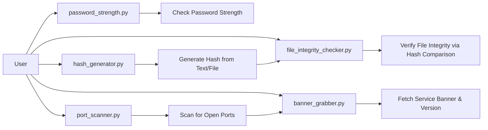
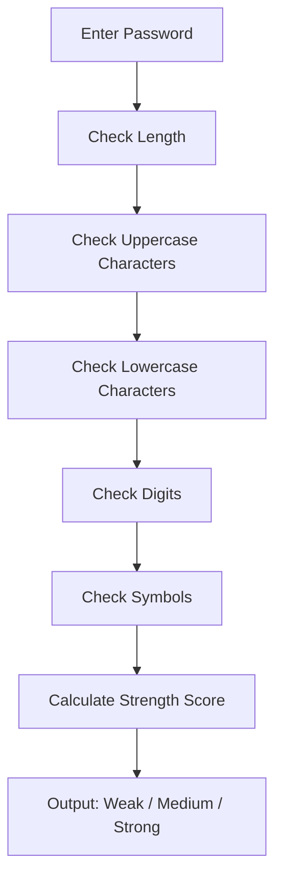
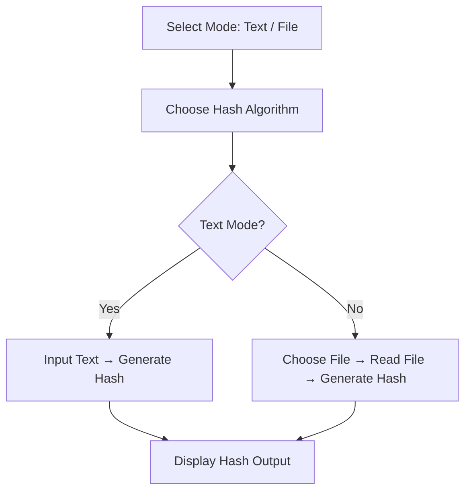
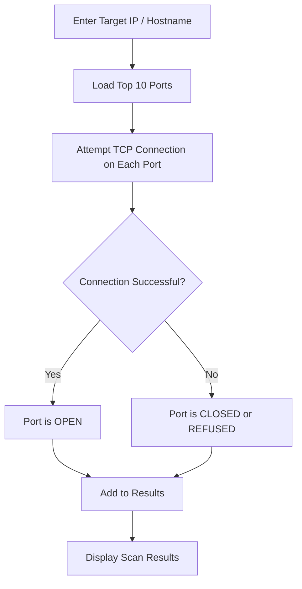
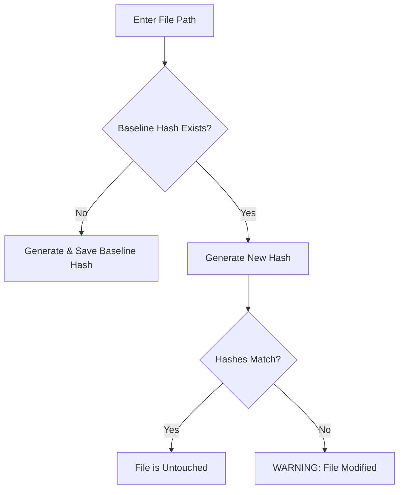
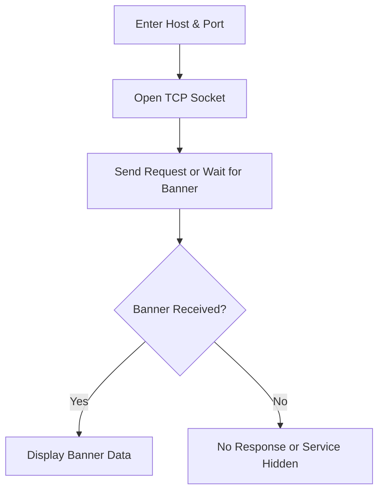

# 🔐 CyberSec Starter Scripts — Python Edition

> 🎓 Beginner-friendly cybersecurity scripts to learn core concepts: hashing, scanning, integrity monitoring, and password strength evaluation.  
> ⚠️ Educational use only — never test on systems without permission.


---

## 🧰 What’s Included?

| Script | Purpose | Why It Matters |
|--------|---------|----------------|
| `password_strength.py` | Checks if a password is strong (length, digits, symbols, etc.) | Learn how attackers evaluate weak passwords |
| `hash_generator.py` | Generates SHA-256 or MD5 hashes from input text or files | Understand how passwords/data are stored securely (or not!) |
| `port_scanner.py` | Scans top 10 ports on a target IP (TCP connect scan) | Learn basics of network reconnaissance |
| `file_integrity_checker.py` | Compares file hash over time to detect tampering | Core concept in malware detection & system monitoring |
| `banner_grabber.py` | Retrieves service version information from open ports | Helps fingerprint services for vulnerabilities |

📁 All scripts are standalone — no complex setup needed.

---

## 🧩 Concept Flow (How All Scripts Work Together)


# ⚙️ Installation & Setup

You only need **Python 3.8+** — no external libraries required.

```bash
git clone https://github.com/K921-cyber/cybersec-starter-scripts.git
cd cybersec-starter-scripts
```
# 📘 Detailed Script Documentation

---

## 1️⃣ `password_strength.py` — Password Strength Checker

Evaluates the strength of a password based on:

- Length  
- Digits  
- Symbols  
- Uppercase and lowercase characters  

### Flowchart


## 2️⃣ `hash_generator.py` — Hash Generator

Generates secure hashes (SHA-256 or MD5) from:

- Input text  
- File contents  

### Flowchart


## 3️⃣ port_scanner.py — Basic Port Scanner

Performs a TCP connect scan on the 10 most common ports.

Flowchart

## 4️⃣ file_integrity_checker.py — File Integrity Checker

Detects file tampering by comparing current and baseline hashes.

Flowchart


## 5️⃣ banner_grabber.py — Banner Grabber

Retrieves service banner/version information from an open port.

Flowchart

# 📄 License

This project is licensed under the MIT License.
You may use, modify, and distribute this project responsibly.


